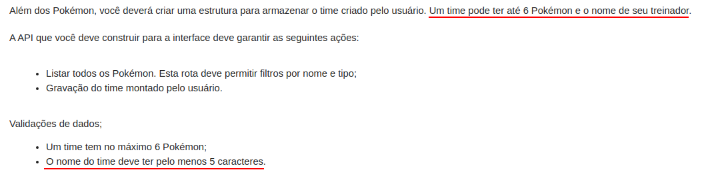

# Explicação Geral

Esta seção serve para explicar de forma mais detalhada algumas escolhas e raciocínios feitos durante o desenvolvimento da API. É importante ressaltar que foi utilizado alguns princípios do SOLID e DDD, mas que **não foi seguido** à risca todos os ensinamentos, eles foram adaptados conforme a realidade do projeto.

# Conteúdo
  - [Campos durante a criação do Time](#campos-durante-a-criação-do-time)
  - [Regras de Negócio](#regras-de-negócio)
  - [Camadas da aplicação](#camadas-da-aplicação)
  - [Banco de Dados](#banco-de-dados)
  - [Single Responsibility Principle](#single-responsibility-principle)
  - [Liskov Substitution Principle](#liskov-substitution-principle)
  - [Dependency Inversion Principle](#dependency-inversion-principle)

## Campos durante a criação do Time

Durante a descrição do desafio, é dito que para criar um time precisa informar os pokémons e o nome do treinador, mas logo em seguida pede-se para validar o nome do time.

Para não haver problemas, foi decidido utilizar os dois campos com a mesma validação quando for necessário criar um novo time. Em relação aos pokémons, não foi especificado como eles devem ser passados para a requisição, assim foi escolhido uma estrutura onde é passado apenas o `id` e o `name` do pokémon dentro de uma lista.

## Regras de Negócio
Como dito anteriormente, as regras de negócio são implementados na camada de serviços da aplicação.

Para listar pokémons não há muitas regras envolvidas, apenas é feito uma validação caso o usuário tente passar múltiplos tipos.

Para criar um time, foi realizado as seguintes validações:
- Validar se o nome do treinador tem pelo menos 5 caracteres.
- Validar se o nome do time tem pelo menos 5 caracteres.
- Validar se foi passado no máximo 6 pokémons.
- Validar se todos os pokémons existentes (é validado o `id` passado).

Também foi realizado outras validações com a biblioteca `celebrate` para verificar se os campos foram passados e se estão no formato adequado, dessa forma não é necessário escrever um código apenas para realizar estas validações.

Quando acontece algum erro, todos são tratados através do *middleware* `validateErrors.js`, ele retorna para o usuário uma lista de erros contendo o campo e a mensagem associado. Atualmente a API está retornando os erros em inglês.

## Camadas da aplicação

O fluxo de dados da aplicação pode ser visualizado na imagem abaixo:

Sua estrutura é bem simples, a camada **Router** recebe a requisição do usuário e passa adiante para o **Controller** que irá direcionar para qual serviço irá tratá-la na camada de **Service**, neste momento será validado todas as regras de negócio desta requisição. Ao finalizar, será direcionado para a camada de **Repository** que é responsável por se comunicar com o banco de dados da aplicação, que neste caso é o MongoDB. Depois de tratar a requisição, a resposta é passada por todas as camadas até chegar na **Router** é retornar para o usuário.

## Banco de Dados

A descrição do desafio afirma que o sistema deve estar pronto para entrar em produção, assim não seria recomendado manter os dados dos pokémons em um arquivo `.json`, e por isso optou-se por utilizar um banco de dados.

A próxima etapa é analisar como os dados serão armazenados. Para salvar a lista de pokémons de um item, necessitaria de uma estrutura mais complexa caso utilizasse um banco de dados relacional, assim para facilitar esta etapa optou-se por utilizar um banco de dados não-relacional.

Ao final desta análise, o banco de dados escolhido para a aplicação foi o MongoDB, pela sua fácil utilização e integração com o Javascript (quando utilizado em conjunto com o Mongoose).

O MongoDB possui seu próprio campo chamado o `_id`, mas decidiu-se continuar utilizando o `id` presente nos dados de pokémon por ficar mais fácil de testar sua utilização quando for criar um time, assim cada pokémon possui dois ids, um do MongoDB e outro dele mesmo. Essa validação pode ser facilmente alterada, precisando apenas modificar os códigos desenvolvidos nos `repositories` e as requisições feitas.

## Single Responsibility Principle

Este é um dos princípios do SOLID, de forma simples ele afirma que uma classe deve possuir uma única responsabilidade. Este princípio foi adotado principalmente para os `services` da aplicação, pois como eles são responsáveis por validar as regras de negócio, é interessante ter vários serviços com suas próprias responsabilidades, ao invés de ter apenas um arquivo com diversas funções (podendo dificultar a manutenção do código).

## Liskov Substitution Principle

Este é um dos princípios do SOLID, onde defende que certas implementações (como *drivers* de upload, e-mail, teste) podem ser substituídos por outros sem "danificar" a aplicação. Este princípio é utilizado na comunicação dos `services` com os `repositories` para os ambientes de desenvolvimento/produção e teste, onde no mesmo serviço é possível utilizar os repositórios para testes unitários e os repositórios da aplicação em si, sem "danificar" o seu funcionamento.

Além disso, com a estrutura de pastas adotado, como o modelo dos módulos e o seu repositório estão isolados nas pastas localiza-se `mongoose`, é possível alterar para o outro banco de dados sem que prejudique os *controllers* e *services* da aplicação.

## Dependency Inversion Principle

Este é um dos princípios do SOLID, onde determina que as classes devem depender de interfaces ao invés de implementações. Para o Javascript, não há uma uma forma de seguir este princípio corretamente (com o Typescript é possível), mas seu conceito básico foi aplicado nos serviços. Ao instanciar um novo serviço é passado como dependência um ou mais repositórios ou outro provedor de dados caso precise, isto possibilita o isolamento das responsabilidades e assim sendo possível aplicar o Liskov Substitution Principle.
