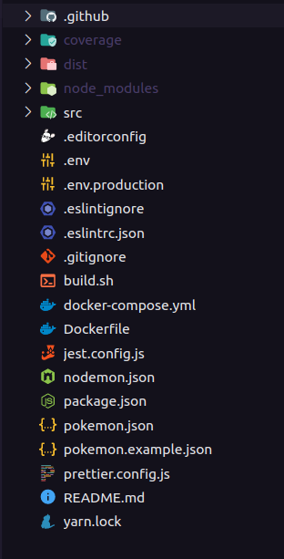
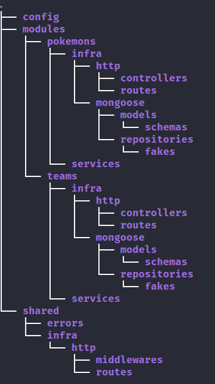

# Visão Geral

Esta API tem como foco manipular dados do universo Pokémon, nesta primeira versão é possível listar todos os pokémons (com opções de filtro) e criar seu próprio time.

Este código está estruturado seguindo práticas abortadas nos princípios de SOLID e DDD.

## Estrutura de pastas

Na raiz do projeto é possível visualizar os seguintes arquivos:



Grande parte dos arquivos são usados para configurações do sistema ou de estilização, a seguir a descrição de alguns arquivos importantes:

- Os arquivos ```.env``` e ```.env.production``` são usados para configuração as variáveis de ambiente do sistema. O primeiro é utilizado para o ambiente de desenvolvimento e o segundo utilizado em conjunto com o Docker. Atualmente Foi dividido em dois arquivos para facilitar a transição entre os ambientes.

- Os arquivos ```pokemon.json``` e ```pokemon.example.json``` são os dados de pokémons passados para a atividade. Como a solução foi desenvolvida visando ser enviada para produção, optou-se por um banco de dados ao invés de um arquivo ```.json```. Para testes unitários este arquivo ainda é utilizado (o ```pokemon.example.json``` está presente apenas para mostrar o arquivo original).

- o arquivo ```Dockerfile``` possui os comandos necessários para realizar o *build* da aplicação, e o ```docker-compose.yml``` cuida de subir o *container* junto com o MongoDB.

- Como optou-se por utilizar um banco de dados ao invés de um arquivo ```.json```, precisa-se popular os pokémons no banco ao iniciar a aplicação. Assim, foi criado o arquivo ```build.sh``` para subir os *containers* e depois popular os dados iniciais.

A pasta ```coverage``` exibe o relatório de testes gerado pelo ```jest```. A pasta ```dist``` contém os arquivos da aplicação após realizar o *build*, é utilizado para o ambiente de produção. Dentro de ```src```, encontra-se de fato os arquivos e pastas da aplicação desenvolvida, conforme abaixo:



Como dito anteriormente, a estrutura do código e pastas foi pensada seguindo alguns princípios do SOLID e DDD, sua estrutura será explicado nos próximos tópicos.

### Config (Configuração)

Esta pasta é responsável por armazenar configurações de acessos externos (como banco de dados, serviços de *cache*, e-mails, serviços de mensageria) e/ou configurações da aplicação. Para esta API, atualmente possui apenas a configuração do banco de dados.

### Modules (Módulos)

A pasta ```modules``` guarda de fato todo os códigos relacionados à regras de negócio e entidades da aplicação. Para cada módulo novo, é criado uma nova subpasta específica para armazenar todas as suas regra.Esta escolha de estrutura foi feita para evitar que as pastas cresçam muito e assim dificultem a manutenção, na forma atual cada módulo segue a mesma estrutura interna e tem pouco risco de haver um crescimento muito grande de códigos em uma pasta.

Cada módulo interno possui uma pasta ```infra``` para armazenar códigos da infraestrutura do módulo e uma pasta ```services``` para armazenar os códigos que serão responsáveis pelas regras de negócio e que também serão testados. Dentro da pasta ```infra``` pode-se observar a pasta ```mongoose``` que possui o esquema utilizado no banco (dentro de ```models```) e o código para consultar ou adicionar dados no banco (dentro de ```repositories```). Por fim, também está presente a pasta ```http``` com as rotas e *controllers* da aplicação.

Os códigos utilizados para realizar os testes unitários estão presentes dentro das pastas ```services```, cada serviço possui um teste relacionado. O repositório utilizado para o ambiente de testes localiza-se dentro de ```repositories``` na pasta ```fakes```, esta divisão foi criada para separar o ambiente de testes do ambiente de desenvolvimento, possibilitando assim rodar testes unitários em um ambiente isolado.

### Shared (Compartilhado)

Esta pasta possui códigos que serão utilizados por toda a aplicação, a subpasta ```errors``` armazena classes de erros que podem ser utilizadas pela aplicação. A subpasta ```infra``` possui as pastas e códigos relacionados com a infraestrutura da aplicação, neste caso temos somente a ```http``` com as pastas de ```routes``` para definir as rotas da aplicação, e ```middlewares``` para armazenar todos os *middlewares* compartilhados.

Nas próximas seções será detalhada o funcionamento das rotas e explicado a estrutura de alguns códigos.
